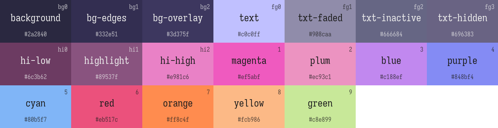
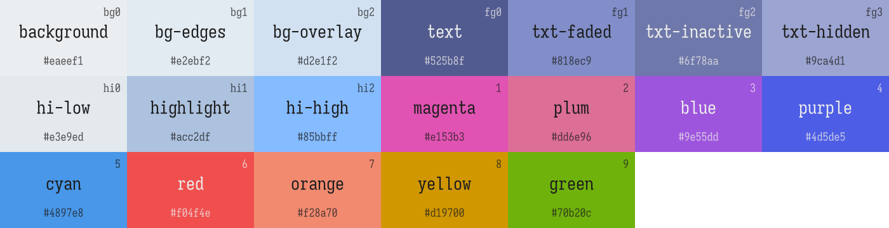

## Rikai's Colorschemes

In my glory days, I have set up my colors in different platforms and software. Alas, as fate would have it, my SSD gave out last year, and so I have dragged on recreating most of them from scratch... But it's fine since I've also changed some of my software preferences...

This repo contains all the configuration for themes I use ~~SO THE NEXT TIME MY SSD GETS AXED, I'D STILL HAVE A COPY~~.

In the works:
- [ ] Jetbrains IDEs (Rider, IntelliJ)
- [ ] Logseq
- [ ] niri

That To-Do list you don't actually do:
- [ ] Alacritty
- [ ] Windows Terminal (yes, I dualboot)
- [ ] XResources (colorful vt ftw)
- [ ] Vencord
- [ ] Avalonia
- [ ] Firefox
- [ ] Kvantum (qt apps)
- [ ] GTK

### Current Palette

Yes, I know the names don't make sense...
#### Moonlight (Dark)

#### Skylight (Light)

I know. My eyes are weird. Red/Orange light strain my eyes. Pure white burns my retinas.
And pitch black is too much contrast for me. Hence my palettes are a bunch of colors (heavily skewed on the R-B side of RGB) that
the average person can't easily distinguish (but I do).

### Screenshots

WIP. SoonTM.

### Directory Structure
#### utilities
I'm lazy, and I am still iterating over the colors (until now), so I've figured it'd be nice to provide a central "generator" of color scheme configurations across all the platforms I use, so I wouldn't lose my sanity changing a byte of color across a bazillion places.

- it automatically generates a palette diagram (i.e. the pictures above)
- generates colorschemes in sublime's format
- generates rider files to be used in plugins (both UI and Syntax Highlighting) 

#### platforms
All the relevant configuration files for the colorschemes. Also, the Jetbrains theme plugin is a submodule; it has its own git tracker. Why? ¯\_(ツ)_/¯

### Colophon and Special Thanks
For the [Catppuccin](https://github.com/catppuccin) project, specifically because I have used your implementations, changed some code, and then now have the gall to label it as mine lol.

For [Vince](https://github.com/vinceliuice) and his particular tastes in KVantum, GTK. Very great places to start with! ~~before my ssd took a cosmic ray in its bits~~

#### Some tear-inducing background. (tears of boredome that is)

Through the years, I've been iterating over my personal color schemes. First, I fell in love with [Material Palenight](https://github.com/drewtempelmeyer/palenight.vim). ~~I use(d) vim btw~~ I was green, after all; falling victim to all those editor flame wars. Realizing `vim`/`nvim` wasn't really working enough for me (`dein` broke again for the umpteenth time). So I never looked back, switched to `Sublime Text`, `Jetbrains IDEs`, and I'm currently looking forward to [Zeditor](https://github.com/zed-industries/zed)'s progress.

My next preference in colorschemes was [Rosé Pine](https://github.com/rose-pine), which was also inspired by Darcula. The dark purple backgroud was definitely inspired from them. However, I am not a fan of the color `Yellow`. Yellow sucks, I'm sorry. It stands out too much in a sea of blues and purples and reds.

My next phase would be [Catppuccin](https://github.com/catppuccin/catppuccin). It's good in the eyes, but a bit too pastel-ly for my taste. This current iteration of my themes is based on the Catppuccino project, however. Thank you!